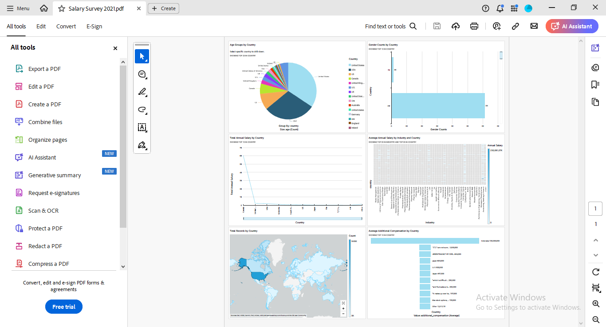

# AWS-Quicksight-Dashboard

Using Salary survey 2021 datset fo several countries, I've prepared Pie Chart, Bar Chart, Line Chart, Tree Map, Geospatial Map and Funnel Chart.

First Pie chart shows Age Group Brackets by Country.

All other visualizations shows different aspects of Gender Counts, Total and Average Annual Salary, Record Counts and Additional Compensation. By selecting one country from a slice in Pie chart, you can drill-down by specific country.

