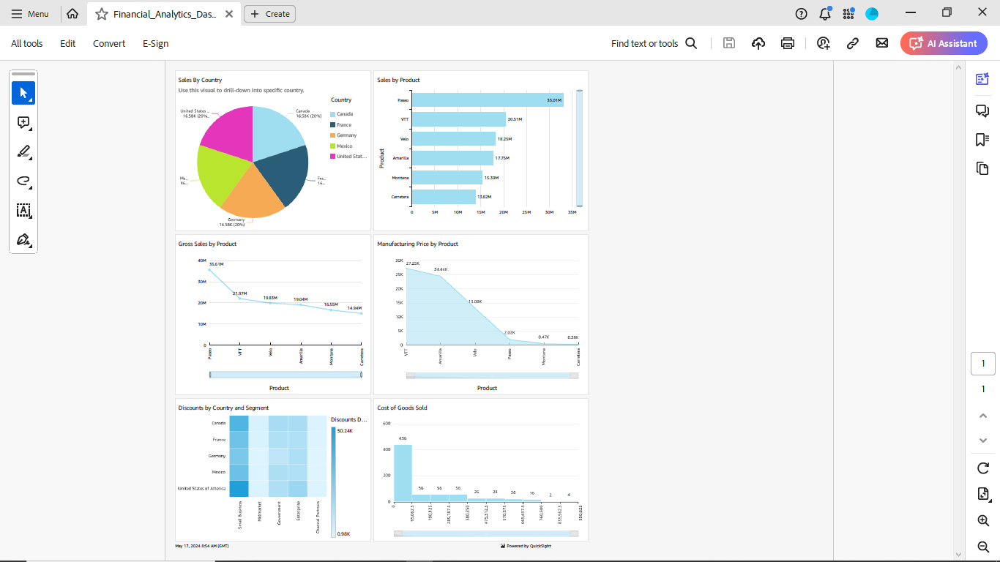

# AWS-Quicksight-Dashboard

Using Financials dataset, I've prepared a dashboard showing various metrics and visualizations.

First Pie chart shows Sales by Country.

All other visualizations shows different aspects of Sales, Gross Sales, Manufacturing Price, Discounts and COGS(Cost of Goods Sold). By selecting one country from a slice in Pie chart, you can drill-down by specific country.

